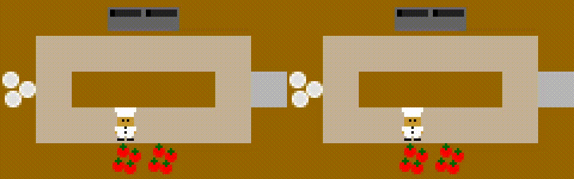
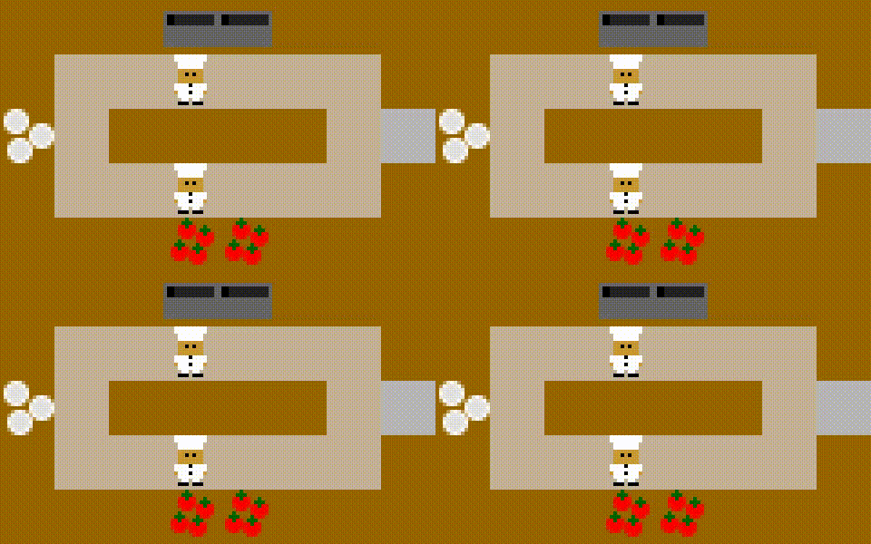
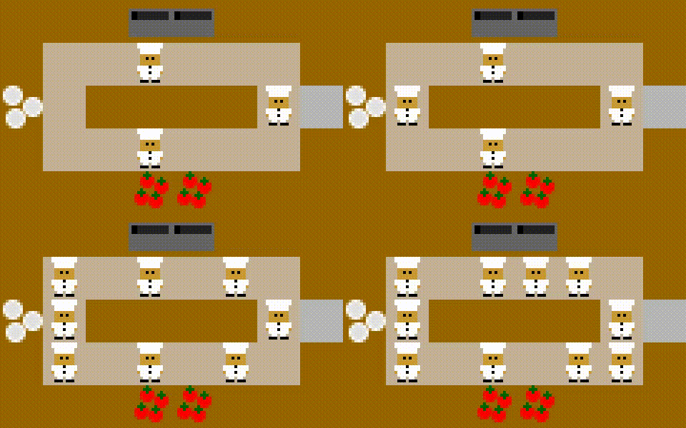

# Cook-CoOp

A cooperative multiplayer cooking simulation game with reinforcement learning. Agents are trained using PPO to coordinate in a kitchen environment, inspired by Overcooked-style cooperative gameplay.

<p align="center">
  
</p>

## Overview

Cook-CoOp provides minimal implementation for:
- A physics-based kitchen simulator supporting multiple cooperative players
- A [Gymnasium](https://gymnasium.farama.org/) environment wrapper for RL training
- A complete PPO training pipeline with 64 parallel environments
- A Pyglet UI for interactive visualization and human play

<p align="center">
  
</p>


## Project Structure

```
cook-coop/
├── game/           # Core game engine (entities, movement, collision)
├── game_env/       # Gymnasium environment wrapper and observation system
├── game_ui/        # Pyglet-based visual renderer and keyboard bindings
├── config/         # Parses ASCII layout files into game entities
├── trained/        # Pre-trained PyTorch model checkpoints
├── ppo_train.py    # PPO training script
└── play.py         # Load a trained agent and watch it play
```

<p align="center">
  
</p>


## Acknowledgement

The visual assets in `game_ui/assets/` are sourced from [HumanCompatibleAI/overcooked_ai](https://github.com/HumanCompatibleAI/overcooked_ai).

The game core engine is built from scratch and differ fundamentally from that project. `overcooked_ai` is a grid-based game; Cook-CoOp uses continuous 2D movement with an AABB (axis-aligned bounding box) collision resolution algorithm, enabling physically plausible players-objects interaction rather than tile-by-tile stepping.


## Environment Setup

### Host (virtual env)

```bash
python3.12 -m venv venv
source venv/bin/activate
pip install -r requirements.txt
```

### Docker

> Pyglet requires a display and is not installed inside the Docker containers. The UI is not needed for headless training — `ppo_train.py` runs without it.


```bash
# CPU
docker-compose up container-cpu

# GPU (requires NVIDIA GPU and NVIDIA Container Toolkit)
docker-compose up container-gpu
```

## Training

```bash
python ppo_train.py
```

Key hyperparameters (configurable via [tyro](https://brentyi.github.io/tyro/) CLI flags):

| Flag | Default | Description |
|------|---------|-------------|
| `--total-timesteps` | `1_000_000` | Total environment steps |
| `--num-envs` | `64` | Parallel environments |
| `--learning-rate` | `2.5e-5` | Adam LR |
| `--clip-coef` | `0.1` | PPO clip range |
| `--ent-coef` | `0.06` | Entropy coefficient |
| `--cuda` | `True` | Use GPU if available |
| `--seed` | `611302` | Random seed |
| `--trained-model-name` | `None` | Resume from checkpoint |

Checkpoints are saved to `trained/`.

## Playing

Watch a trained agent play interactively:

```bash
python play.py
```

This loads `trained/circuit_room_2__1671437407.pth` and opens a Pyglet window. The agent acts autonomously; human players can also join via keyboard.


## Architecture

### RL Setup

- **Algorithm**: PPO with GAE advantage estimation
- **Network**: CNN (2 conv layers) → 512-dim FC → actor (6 actions) + critic (value)
- **Observation**: In `game_env`'s observation space, each unit in the game is rendered as a 5×5 pseudo-pixels, each pixel take the value of `0`, `0.5` or `1.0`, so an 8×5 layout (e.g. `circuit_room`) produces a 40×25 1-chanel image. See the `game_env/pseudo_pixels_5x5` dir.
- **Action space**: `NOOP`, `UP`, `DOWN`, `LEFT`, `RIGHT`, `INTERACT` (6 discrete actions)
- **Reward**: Shared across all agents (sum of individual rewards per step)

### Key modules

| Module | Role |
|--------|------|
| `game/game.py` | Game tick, player actions, interaction logic |
| `game/collision.py` | AABB collision detection math |
| `game/movement.py` | Continuous movement resolution |
| `game_env/env.py` | `GameEnv`: Gymnasium `Env` wrapper |
| `game_env/observe.py` | Converts game state to pixel observations |
| `game_env/serialize.py` | Flattens dict obs/actions to arrays for batch training |
